## [《深入理解 TCP 协议：从原理到实战》](https://s.juejin.cn/ds/DJSYpRU/)

TCP/IP 协议族指的是在 IP 协议通信过程中用到的协议的统称，而非TCP、IP这两种协议

- **应用层**：规定了应用程序之间如何相互传递报文，常见的协议有 HTTP、域名解析协议 DNS和收发邮件的协议 STMP等
- **传输层**：为两台主机之间的 **「应用进程」** 提供**端到端**的逻辑通信，常见的协议有 TCP、UDP协议
- **网络互连层**：**主机到主机的通信**，将传输层产生的的数据包封装成分组数据包发送到目标主机，并提供路由选择的能力。
IP 协议是网络层的主要协议，TCP 和 UDP 都是用 IP 协议作为网络层协议。这一层的主要作用是给包**加上源地址和目标地址**，**将数据包传送到目标地址**
- **网络访问层**：也叫做网络接口层，以太网、Wifi、蓝牙工作在这一层，网络访问层提供了主机连接到物理网络需要的硬件和相关的协议

分层的好处是什么？

1. 各层独立，不需要了解上下层是如何工作的，各层的修改不影响其他层
2. 职责清晰，方便进行标准化

### TCP协议

TCP 是一个**可靠的**（reliable）、**面向连接的**（connection-oriented）、**基于字节流**（byte-stream）的**全双工**（full-duplex）通信协议

可靠性的保证主要有以下几个方面：**校验和**；**包的序列号用来解决数据的乱序和重复**；**超时重传**；**流量控制**；**拥塞控制**

**面向连接**是指在正式发送数据之前需要通过**握手来建立逻辑连接**，而结束通信时，也是**通过有序的四次挥手来断开连接**

基于字节流指的是**没有固定的报文边界**，发送方写入的报文和接收方读取的报文可能不一致，比如说发送方发送500字节和800字节的报文，
而在接收方读取时可能是以1000字节和300字节读取的。这种情况取决于：路径最大传输单元MTU、发送窗口大小和拥塞窗口大小等。

全双工指的是客户端和服务端既可以发送数据也可以接收数据。

#### TCP首部字段

窗口大小默认16位，也就是窗口最大大小为 655535 字节，由于该值太小，便引入了 **TCP窗口缩放** 参数来作为窗口缩放的比例因子，该值范围为 0 - 14，
它是2的指数幂大小，当为0时不进行缩放，下图中抓包信息就没有对窗口值进行缩放。

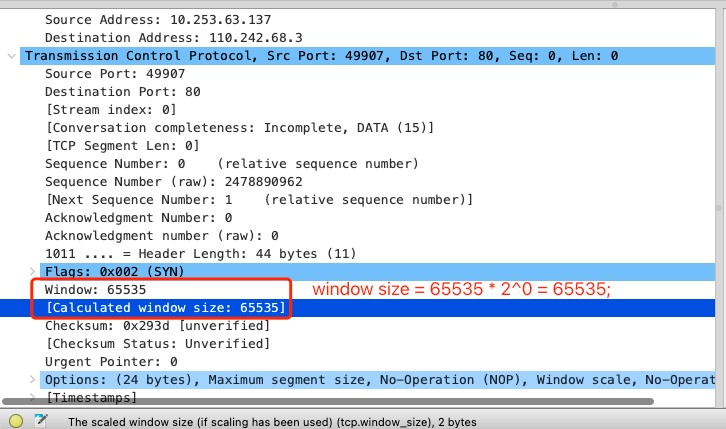

#### 三次握手

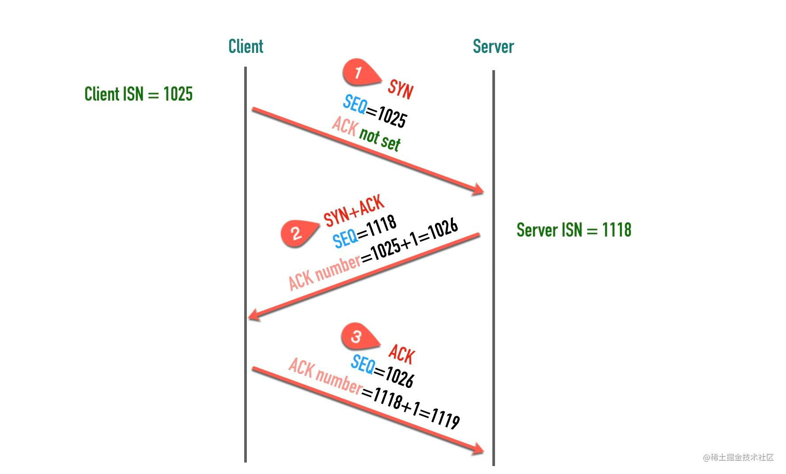

ACK值为期待对侧下次发送报文的SEQ

服务端ACK = 客户端SEQ + 客户端发送的报文长度

SEQ则表示本次当前客户端/服务端发送的序列号

1. 客户端初始状态为 `CLOSED`，调用 `connect()` 方法连接服务器后会发送**SYN同步报文**，随后便进入 `SYN-SENT` 状态，
客户端将保持这个状态直到收到服务端发送的**ACK确认报文**
2. 服务端处于 `LISTEN` 状态，等待客户端进行连接，当收到客户端的**SYN同步报文**时，会回复**ACK确认报文**和自己的**SYN同步报文**，
这时服务器进入 `SYN-RCVD` 状态等待客户端**ACK确认报文**
3. 客户端收到服务端的**ACK确认报文**和**SYN同步报文**后，发送**ACK确认报文**给服务端，同时进入 `ESTABLISHED` 状态，表示连接完毕已经可以发送数据了
4. 服务端收到客户端的**ACK确认报文**后，也进入 `ESTABLISHED` 状态，等待数据的发送

**SYN同步报文**不携带数据，但是它占用一个序号，**任何凡是消耗TCP序号的报文，都需要对端的ACK确认报文**，如果没有收到确认，会一直重传到指定的次数为止。
在三次握手的过程中，除了交换彼此的初始序列号，还有一些其他辅助信息：MSS（TCP报文最大段大小）、窗口大小、窗口缩放因子和是否支持选择确认等。

注意：初始序列号在生成时是**随机的**，因为这样能够保证安全性，增加伪造报文的难度，还能在开启 `SO_REUSEADDR` 允许端口重用的情况下，
避免因网络延迟产生新旧连接数据报文混淆的问题。

##### 握手可以变成四次吗？

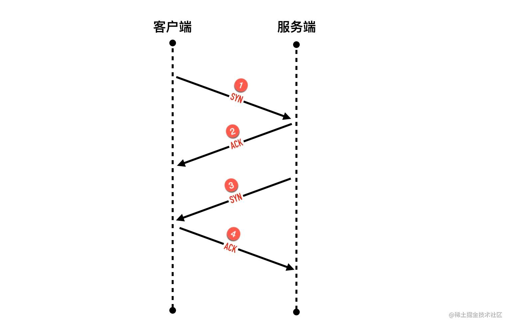

理论上是可以的，将第二次握手拆成两个包，分别发送**ACK确认报文**和**SYN同步报文**。

#### 四次挥手

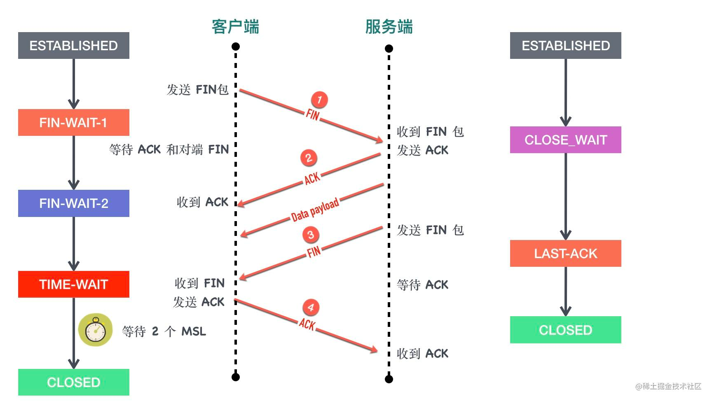

1. 客户端调用 `close()` 方法，执行主动关闭，会发送**FIN报文**给服务端，在这之后客户端就不会再向服务端发送数据了，但是还能接收服务端发送的数据。
此时客户端进去 `FIN-WAIT-1` 状态。
2. 服务端在收到**FIN报文**后回复**ACK确认报文**给客户端，随后服务端进入 `CLOSE_WAIT` 状态，客户端收到**ACK确认报文**以后进入 `FIN-WAIT-2` 状态。
3. 服务端也没有数据要发送了，发送**FIN报文**给客户端，然后进入`LAST-ACK`状态，等待客户端回复**ACK确认报文**。
4. 客户端收到服务端的**FIN报文**后，回复**ACK确认报文**，并进入 `TIME_WAIT` 状态，等待2个MSL以后进入 `CLOSED` 状态。服务端收到ACK确认报文后，
进入 `CLOSED` 状态。

##### 四次挥手可以变成三次吗？

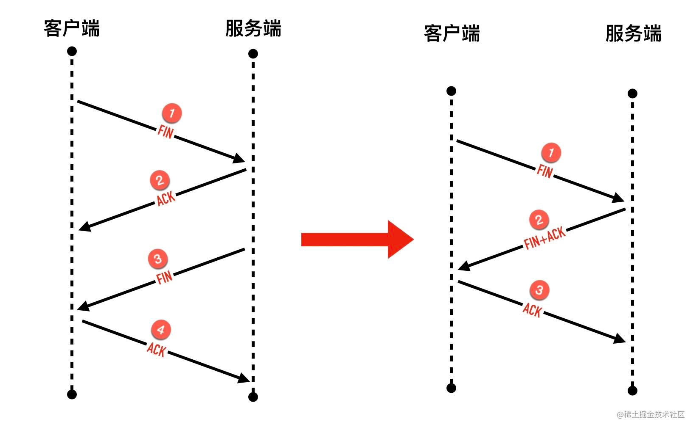

可以的，如果在服务端收到客户端的**FIN报文**后，没有数据再给客户端发送，那么可以将**FIN报文**和**ACK报文**合成一个数据包发送，这样就成了三次挥手。

##### TIME_WAIT 状态

四次挥手主动断开的端会进入 `TIME_WAIT` 状态，并持续 **2MSL**。**MSL(MAX Segment Lifetime)** 表示TCP 报文在网络中的最大生存时间，
IP报文头信息中的 **TTL(Time to line)** 字段与它关系密切，它表示最多能够经过的路有数，每经过一个路由器，TTL值就会减1，减为0时就会被丢掉。

TIME_WAIT 存在的原因：

1. 要使当前连接中延迟的报文在网络中失效，这样就能避免使用相同端口号与服务端创建的新连接产生新旧数据混淆的问题
2. 确保TCP全双工通信的关闭，如果最终的**ACK确认报文**丢失，对端需要重新发送**FIN报文**，如果主动关闭方不维持2MSL时长，则会造成**ACK确认报文**无法回传，
使得被动关闭方不能及时释放连接的问题

为什么是2MSL：

2MSL = 去向**ACK确认报文**的最大存活时间 + 来向**FIN报文**的最大存活时间

1个MSL保证四次挥手中主动关闭方最后的**ACK确认报文**能最终达到对端；1个MSL确保对端没有收到**ACK确认报文**时重传的**FIN报文**可以到达

#### 超时重传

当发生丢包时，发送方会对其进行重传，重传时间间隔是指数级退避，直到120s为止，重传次数为15次。**快速重传**是当发送方接收到3个或以上重复的**ACK确认报文**时，
马上就进行重传而不需再进行超时等待。

#### 滑动窗口

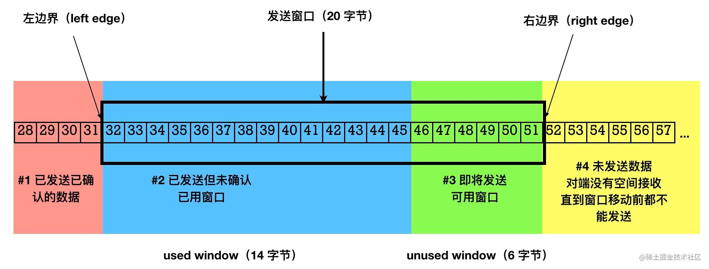

**发送窗口**是发送端被允许发送的最大数据包的大小

**可用窗口**表示发送端还能发送的最大数据包的大小

窗口的左边界表示成功发送且已经被接收方确认的最大字节序号，窗口的右边界是发送方可以发送的最大字节序号，滑动窗口大小等于右边界减去左边界，
用它来控制发送端发送报文的速率

##### TCP window full 和 TCP Zero Window

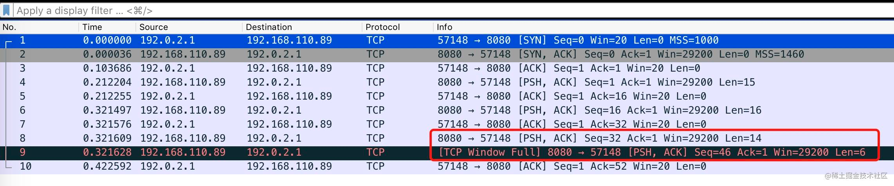

这种情况表示发送方已经把接收方声明的**接收窗口用完了**

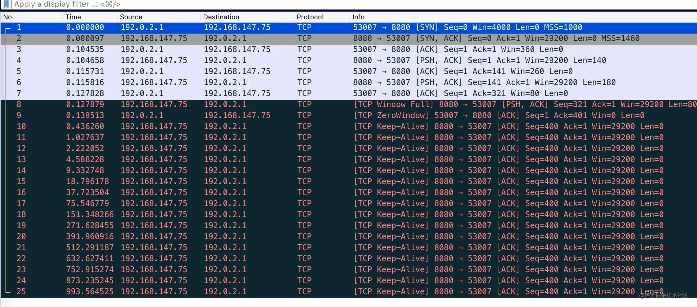

第9个包是接收端回复的**ACK确认报文**，`TCP Zero Window` 表示接收端已经不能再接收任何数据了，而下方的 `TCP Keep-Alive` 包则是**零窗口探针**，
它用来探测接收方什么时候能再次接收数据包。

#### 拥塞控制

滑动窗口可以防止发送端向接收端过多的发送数据，但也只是关注了发送端和接收端自身的情况。拥塞控制则是考虑**整个网络的通信情况**，
它涉及的算法有**慢启动**、**拥塞避免**、**快速重传**和**快速恢复**，需要关注的TCP连接的状态值：**拥塞窗口**（Congestion Window, cwnd）
和**慢启动阈值**（Slow Start Threshold, ssthresh）。

##### 拥塞窗口

拥塞窗口（cwnd）是**发送端**的限制，是发送端在还**未收到对端 ACK 之前**还能发送的数据量大小，而滑动窗口中的发送窗口是**接收端**的限制，
真正的发送窗口大小是两个窗口中的小值。

##### 慢启动

每个TCP连接都有拥塞窗口的限制，起初这个值和你下，随着时间的推送，在每次发送的数据都不丢包的情况下，慢慢的递增，这就被称为慢启动。

##### 慢启动阈值

慢启动算法不能让拥塞窗口无止境的增长，当拥塞窗口大小小于该值时呈指数级别增长（慢启动）；当拥塞窗口大于该值时则按线性增长（拥塞避免）

##### 拥塞避免

拥塞避免是当拥塞窗口大小大于慢启动阈值时，每往返一个 `RTT`，拥塞窗口大于增加一个MSS的大小，直到检测到拥塞为止。

##### 快速重传

当接收端收到一个**不按序到达的报文**时，TCP **立刻**发送 1 个重复 ACK，而不用等有数据捎带确认，
当**发送端**收到 3 个或以上重复 ACK，就意识到之前发的包可能丢了，于是马上进行重传，不用等待重传定时器超时再重传。

##### 选择确认（Selective Acknowledgment, SACK）

发送 3、4、5 包收到的全部是 ACK=1001，快速重传解决了一个问题: 需要重传。因为除了 2 号包，3、4、5 包也有可能丢失，
那到底是只重传数据包 2 还是重传 2、3、4、5 所有包呢？选择确认机制解决了这个问题，接收端会告诉发送端已经接收到的包的范围，如下图所示

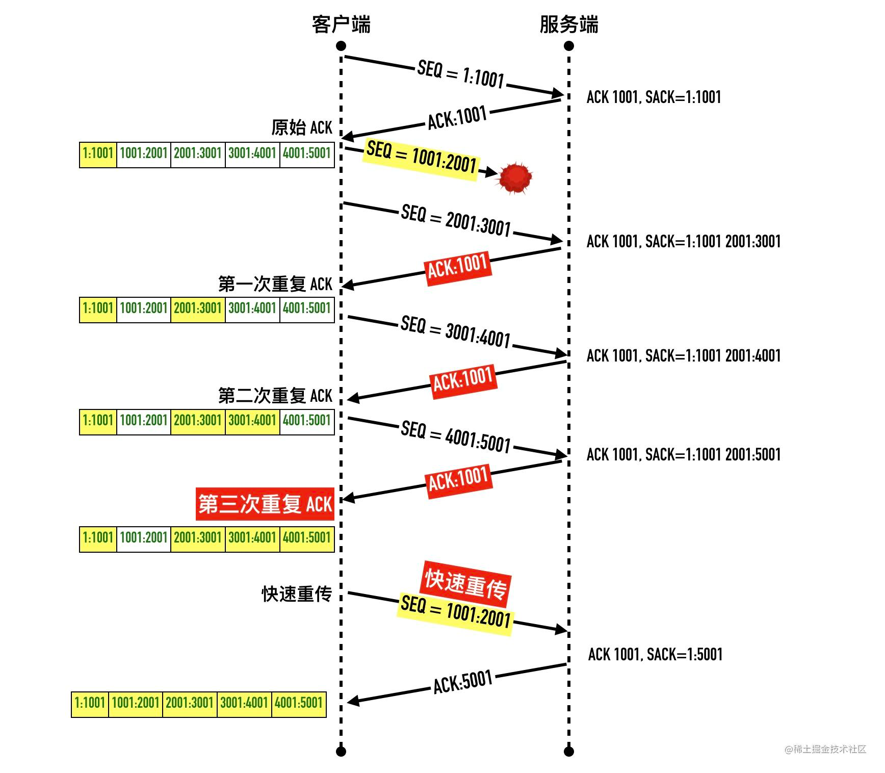

其中SACK表示已经接收到的报文范围，这样发送端只重传丢失的2号包就好了

##### 快速恢复

当收到三次重复的ACK时，进入**快速恢复阶段**，表示网络轻度拥塞，慢启动阈值变为拥塞窗口的一半，拥塞窗口变为当前慢启动阈值的大小，之后采用线性增长

#### RST

**RST报文**用于将异常的连接关闭，发送 **RST报文** 关闭连接时，不必等缓冲区的数据都发送出去，直接丢弃缓冲区中的数据，连接释放进入 `CLOSED` 状态，
而接收端也无需发送**ACK确认报文**。

出现RST的几种情况：

1. 端口未监听
2. 连接信息丢失，但是发送方并不知道而继续发送数据

`Broker pipe` 和 `Connect rest` 是两种常见的网络编程异常，出现的前提都是服务端已发送**RST报文**，连接已关闭的状态。

在一个 RST 的套接字继续写数据，就会出现`Broken pipe`；在一个 RST 的套接字继续读数据，就会出现`Connect rest`

#### TCP 头部时间戳选项

`Timestamps` 是TCP协议中请求头信息中的选填内容，以如下抓包为例

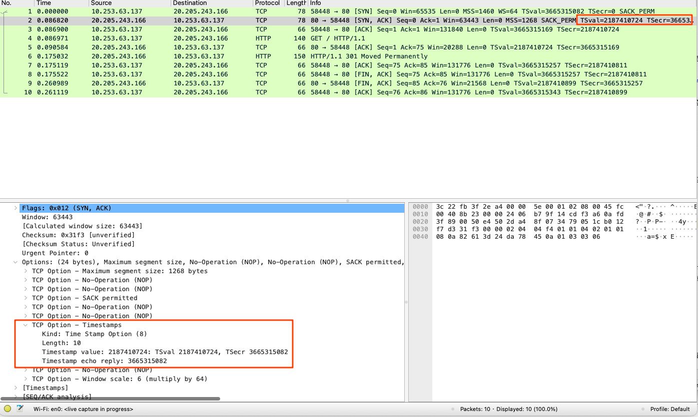

其中 `TSval` 是 `TS value`，`TSecr` 是 `TS Echo Reply`，分别代表发送时的时间戳和接收到的时间戳，它能够用来计算往返时延（`RTTM`）

#### MTC 最大传输单元

最大传输单元是指**数据链路层**帧大小限制，不能把太大的包直接塞给链路层传输。所以当一个IP数据包大于MTU时，会将数据进行报文切割，
使得它小于MTU再通过数据链路层进行传输，IP协议头部有一个表示**分片偏移量**的字段来表示该分段在原报文中的位置。一个包从发送端传输到接收端，
中间跨越很多网络，而每条链路上的MTU可能都不一样，整条链路上的MTU由最小的决定（木桶效应）。

执行 `ping -s 3000 www.baidu.com` 来演示报文分割，其中 -s 表示要指定发送数据的字节数

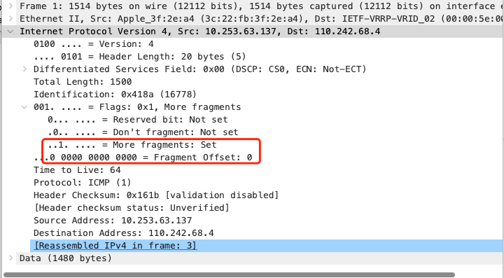

报文分割的第一个包，`More fragments: Set` 表示这个包是 IP 分段包的一部分，还有其它的分片包，`Fragment offset: 0`表示分片偏移量为 0

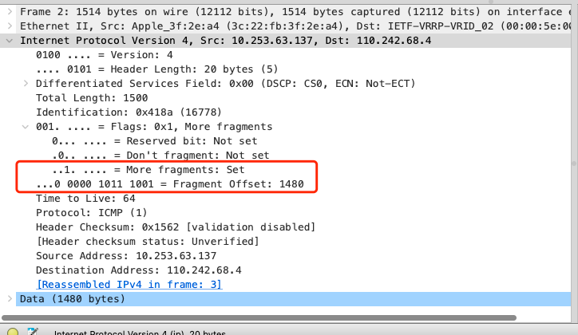

报文分割的第二个包，`Fragment offset: 1480`，这里表示第一个包的 `payload` 大小

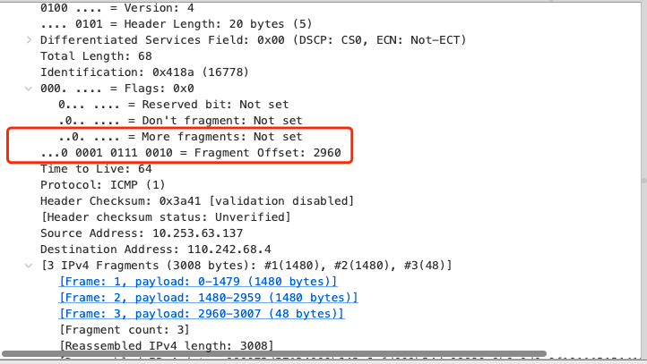

报文分割的第三个包，`More fragments: Not set` 表示这个包是最后一个分片，`Fragment offset: 2960` 为偏移量。

由于IP协议是不会对丢包进行重传，只能依赖于传输层TCP协议重传。

#### MSS TCP最大段的大小

TCP为了避免被发送方分片，会主动将数据分割成小段再交给网络层，最大的分段大小成为MSS。`MSS = MTU - IP header头大小 - TCP 头大小`，
在以太网中 MSS = 1500 - 20 - 20 = 1460（无表头选项的情况下），这样就能将一个 MSS 的数据恰好装进一个 MTU 而不用分片了。

### 端口号

分层结构中每一层都有一个唯一标识，比如数据链路层的 MAC 地址，网络互联层的 IP 地址和传输层的端口号。端口号用来区分主机上的应用程序。

### TCP Fast Open

TFO（TCP 快速打开）是在TCP基础上的扩展协议，对三次握手进行了优化，它需要先完成一次正常的三次握手，
之后就能够借助 `Fast Open Cookie` 在之后建立连接时，第一次发送**SYN同步报文**时就开始传输数据，如下图中右侧所示

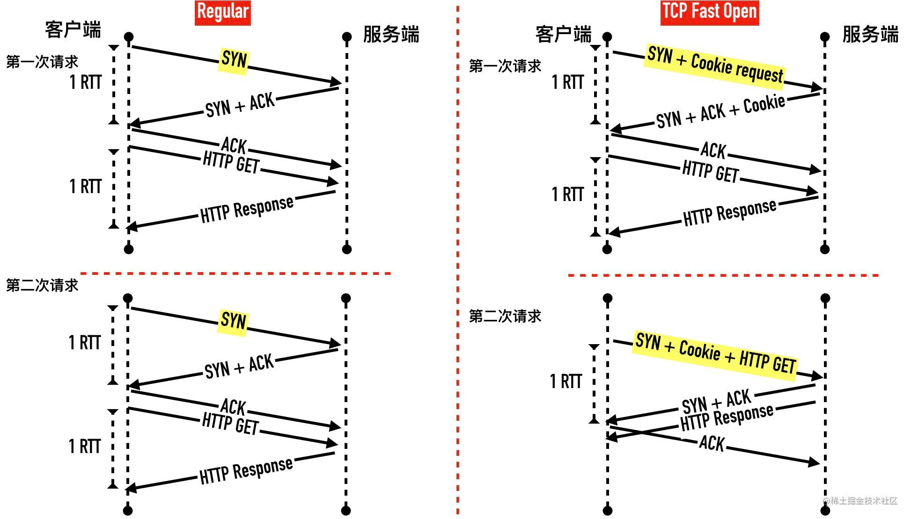

第一次三次握手时，客户端将 Cookie 值保存起来用于之后的TFO，它的优势是从第二次请求开始可以在**一个RTT时间**拿到响应数据
（RTT Round-Trip Time: 指最后一个比特推送到数据链路上直到收到确认报文的时间）。

### Nagle算法

Nagle算法的作用是减少小包在客户端和服务端的直接传输。当一个TCP连接中有**在传数据**时，小于MSS的报文段就不能被发送，直到所有的在传数据都收到ACK后，
此时TCP还不会立即发送数据，而是会收集小包一起发送，代价是会有一些延迟。

### Wireshark 工具

#### 1. 过滤指定域名的包

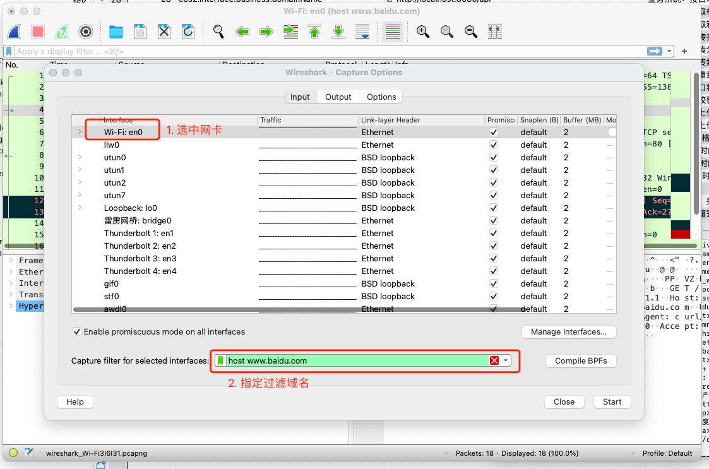

执行 `curl http://www.baidu.com`

curl是在命令行下工作的文件传输工具，支持文件的上传和下载

`curl -v www.baidu.com` 会显示通信过程

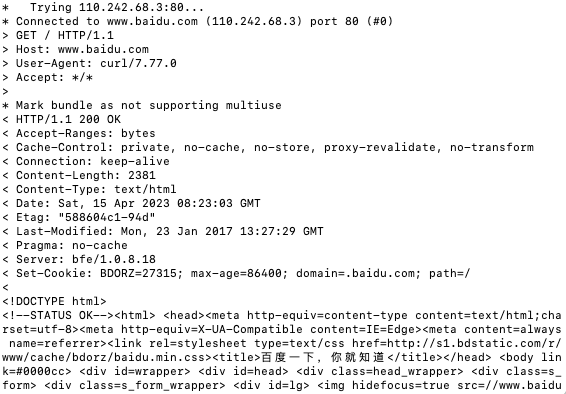

#### 异常解决

安装完成后提示 `The capture session could not be initiated on interface 'en0' (You don't have permission to capture on that device).`

执行 `sudo chmod o+r /dev/bpf*` 修改权限即可

### 网络相关命令行操作

- `telnet ip port` 和 `nc -v ip port`: 查看服务器端口是否打开
- `sudo netstat -ltpn | grep :22`: 查看端口被什么进程监听占用